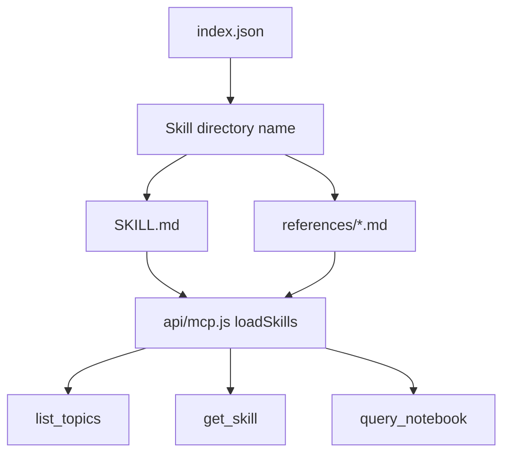

Agent Skills are the repository’s reusable knowledge packages. They convert selected notebook and framework material into discrete `SKILL.md` files with optional reference documents, then advertise them through a shared discovery index.

## What This Concept Is

The skill registry lives under [`.well-known/agent-skills/`](/workspace/home/personal-site/.well-known/agent-skills). The root file [`.well-known/agent-skills/index.json`](/workspace/home/personal-site/.well-known/agent-skills/index.json) is the canonical list of published skills. Each entry points to a folder containing:

- `SKILL.md`
- optionally `references/*.md`

In the current repository snapshot, the registry publishes five skills:

- `ai-foundations`
- `knowledge-systems`
- `ai-system-design`
- `agent-tools`
- `agent-experience-design`

The problem this solves is scope control. The notebook contains many topics, but agents often need a tighter, task-shaped package with trigger-rich descriptions and curated references. Skills provide that packaging.

## How It Relates to Other Concepts

Skills sit between static content and the MCP server. They are static markdown files on disk, but [`api/mcp.js`](/workspace/home/personal-site/api/mcp.js) reads them dynamically and exposes them through `list_topics`, `get_skill`, and `query_notebook`. That means a client can either install the skill bundle directly or query the same skill content remotely through MCP.



## How It Works Internally

`loadSkills()` in [`api/mcp.js`](/workspace/home/personal-site/api/mcp.js) is the important function. It does not scan every directory under `.well-known/agent-skills`. Instead it reads `index.json`, iterates over `index.skills`, and trusts each entry’s `name` to map to a folder. For each skill it:

1. Reads `SKILL.md`.
2. Checks for a `references` directory.
3. Loads each `*.md` reference file.
4. Builds an in-memory object shaped like:

```ts
type LoadedSkill = {
  description: string;
  content: string;
  references: Record<string, string>;
};
```

That design makes the registry explicit. A folder is not public until it is added to `index.json`. This matters because the discovery index is effectively the public API for both the skill installer flow and the MCP server.

### Basic usage

Install the published skill bundle from GitHub:

```bash
npx skills add https://github.com/katrinalaszlo/personal-site
```

Or inspect the registry directly:

```bash
curl https://katrinalaszlo.com/.well-known/agent-skills/index.json
```

### Advanced usage

Fetch a specific skill and inline its references over MCP:

```bash
curl -X POST https://katrinalaszlo.com/api/mcp \
  -H 'Content-Type: application/json' \
  -d '{
    "jsonrpc": "2.0",
    "id": 7,
    "method": "tools/call",
    "params": {
      "name": "get_skill",
      "arguments": {
        "skill_name": "agent-experience-design",
        "include_references": true
      }
    }
  }'
```

That request succeeds because `get_skill` looks up `args.skill_name` in the object produced by `loadSkills()`, then appends each reference block when `include_references` is truthy.

<Callout type="warn">Do not create a skill directory without updating `index.json`. `loadSkills()` never discovers unpublished directories automatically, so the skill will be invisible to both installers and MCP clients.</Callout>

<Accordions>
<Accordion title="Why use an explicit index instead of folder auto-discovery?">
The explicit registry makes the public surface stable. Auto-discovery would be simpler to author, but it would also publish draft folders accidentally and create ambiguity around ordering, naming, and descriptions. By forcing every skill through `index.json`, the repository can attach descriptions, schema metadata, and digests in one place. The downside is an extra synchronization step, but for a curated content bundle that is usually the safer choice.
</Accordion>
<Accordion title="Why keep references as separate markdown files instead of one larger SKILL.md?">
Splitting reference material keeps the primary skill prompt focused while preserving depth for follow-up calls. A short `SKILL.md` is better for tool descriptions and low-token installs, while larger reference files can be loaded only when a client explicitly asks for them. This split is visible in the `agent-experience-design` skill, where the top-level skill is concise but detailed essays such as `agent-self-serve.md` and `mutual-legibility.md` stay in `references/`. The trade-off is that authors must think about packaging boundaries instead of writing one long document.
</Accordion>
</Accordions>

## Source Highlights

The discovery index already shows the intended usage style:

```json
{
  "name": "agent-experience-design",
  "type": "skill-md",
  "description": "Design products that AI agents can use..."
}
```

That description in [`.well-known/agent-skills/index.json`](/workspace/home/personal-site/.well-known/agent-skills/index.json) is not decorative. It is the text returned by `list_topics` and part of the searchable corpus in `query_notebook`.

The skill body itself follows a pattern worth preserving:

```md
## When to use this skill

- Building an MCP server or agent-facing API
- Adding agent signup, auth, or billing to your product
```

That structure in [`.well-known/agent-skills/agent-experience-design/SKILL.md`](/workspace/home/personal-site/.well-known/agent-skills/agent-experience-design/SKILL.md) gives agents high-signal trigger phrases instead of generic descriptions.

## Authoring Guidance

Good skills in this repository have three properties:

- A narrow problem statement in the frontmatter description.
- Strong "when to use this skill" triggers.
- Reference files only where the topic truly benefits from deeper material.

If you are adding a new one, continue to [Publish a New Agent Skill](/docs/guides/publish-agent-skill).
