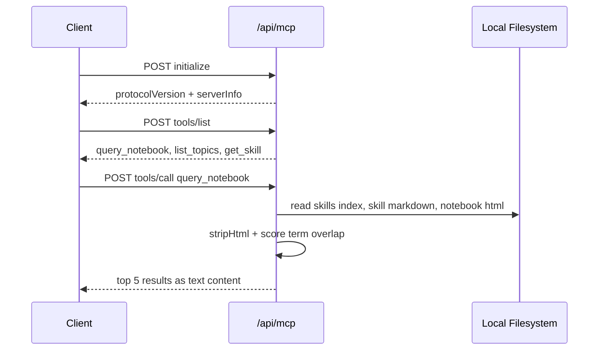

This repository is structured as a static content system first and a lightweight agent interface second. Most files are directly deployed assets, while [`api/mcp.js`](/workspace/home/personal-site/api/mcp.js) is the only runtime module.

```mermaid
graph TD
  A[index.html and index.md] --> B[Human-readable profile]
  C[llms.txt and llms-full.txt] --> D[Agent-readable profile]
  E[agents.json and well-known manifests] --> F[Discovery metadata]
  G[notebook/*.html] --> H[Notebook content]
  I[agent-skills/index.json] --> J[Skill registry]
  K[agent-skills/*/SKILL.md + references] --> J
  H --> L[api/mcp.js]
  J --> L
  K --> L
  M[vercel.json Link headers] --> F
  L --> N[/api/mcp JSON-RPC endpoint]
```

## Module Relationships

The homepage is authored twice on purpose. [`index.html`](/workspace/home/personal-site/index.html) is the browser-facing page, while [`index.md`](/workspace/home/personal-site/index.md) gives the same profile in a compact markdown form. The agent-facing mirrors are [`llms.txt`](/workspace/home/personal-site/llms.txt), [`llms-full.txt`](/workspace/home/personal-site/llms-full.txt), and [`agents.json`](/workspace/home/personal-site/agents.json). That duplication keeps the public surface simple: each audience gets a format optimized for how it consumes content.

The notebook is a folder of standalone HTML essays under [`notebook/`](/workspace/home/personal-site/notebook). Shared presentation is centralized in [`notebook/notebook.css`](/workspace/home/personal-site/notebook/notebook.css), and navigation is injected by [`notebook/nav.js`](/workspace/home/personal-site/notebook/nav.js). The navigation script defines grouped sections, flattens them into a `topics` array, computes the current page by matching `window.location.pathname`, then creates both the sidebar and the previous/next links. That means every notebook page remains a static HTML document while still sharing a single navigation source.

The only executable backend logic is the Vercel handler in [`api/mcp.js`](/workspace/home/personal-site/api/mcp.js). It reads two local content trees:

- `/.well-known/agent-skills/index.json` plus each skill directory
- `/notebook/*.html`, excluding `index.html`

At runtime the handler:

1. Loads skills from the discovery index.
2. Reads each `SKILL.md` and optional `references/*.md`.
3. Reads notebook HTML pages and converts them to plain text with `stripHtml`.
4. Caches both datasets in process memory.
5. Exposes three MCP tools over JSON-RPC.

## Data Flow



## Key Design Decisions

### Static-first content instead of a framework

[`CLAUDE.md`](/workspace/home/personal-site/CLAUDE.md) explicitly states "Pure HTML/CSS/JS. No framework, no dependencies, no build tool." That decision keeps deployment friction low and makes the site readable as plain files. It also matches the project goal: the output is content, not a reactive application. The MCP layer is additive rather than foundational, so the human-facing site still works even if the serverless endpoint is removed.

### File-backed search instead of a database

`loadSkills()` and `loadNotebookPages()` in [`api/mcp.js`](/workspace/home/personal-site/api/mcp.js) read directly from disk with `fs.readFileSync` and `fs.readdirSync`. There is no indexing service, vector store, or external cache. That makes cold starts predictable and keeps the content source of truth on disk, which is appropriate for a small site where updates happen through Git commits rather than user-generated writes.

### Lowest-complexity ranking strategy

The `searchContent()` function lowercases the query, splits it on whitespace, and scores documents by counting how many query terms appear in the text. It is intentionally simple: no stemming, phrase matching, or semantic ranking. The trade-off is recall and ranking quality, but the benefit is full transparency and zero extra infrastructure. This is consistent with the project’s general pattern of preferring legible static content over opaque systems.

### Multiple discovery formats for different agents

Discovery information is duplicated across [`vercel.json`](/workspace/home/personal-site/vercel.json), [`.well-known/api-catalog`](/workspace/home/personal-site/.well-known/api-catalog), [`.well-known/ai-plugin.json`](/workspace/home/personal-site/.well-known/ai-plugin.json), [`.well-known/agent-card.json`](/workspace/home/personal-site/.well-known/agent-card.json), and [`.well-known/mcp/server-card.json`](/workspace/home/personal-site/.well-known/mcp/server-card.json). This is deliberate. Different agent ecosystems look for different standards, so the repository publishes a small amount of repeated metadata instead of betting on one discovery protocol.

## Lifecycle of a Content Update

When you add a new notebook essay, the update path is mostly manual but highly predictable:

1. Add the HTML page under [`notebook/`](/workspace/home/personal-site/notebook).
2. Add the navigation entry in [`notebook/nav.js`](/workspace/home/personal-site/notebook/nav.js).
3. Optionally add a card to [`notebook/index.html`](/workspace/home/personal-site/notebook/index.html).
4. Deploy.
5. On the next MCP request, `loadNotebookPages()` picks up the new file automatically because it reads every `*.html` page except `index.html`.

The Agent Skills flow is similar, but the registry is explicit. You must add the directory and also update [`.well-known/agent-skills/index.json`](/workspace/home/personal-site/.well-known/agent-skills/index.json), because `loadSkills()` trusts the discovery index rather than scanning subdirectories blindly.

## Architectural Caveats

- [`notebook/nav.js`](/workspace/home/personal-site/notebook/nav.js) lists `agent-evaluation.html`, `openclaw-personal-agents.html`, and `hermes-orchestration.html`, but those files are not present in the current repository snapshot. Navigation changes are therefore not fully self-validating.
- The caches in [`api/mcp.js`](/workspace/home/personal-site/api/mcp.js) persist per serverless instance. Content changes after boot are not visible until a new instance starts.
- `stripHtml()` is intentionally lossy. It removes layout noise well, but it also drops richer semantics such as tables and interactive state.

For the core abstractions behind those trade-offs, continue to [Machine-Readable Endpoints](/docs/machine-readable-endpoints), [Agent Skills](/docs/agent-skills), and [MCP Server](/docs/mcp-server).
