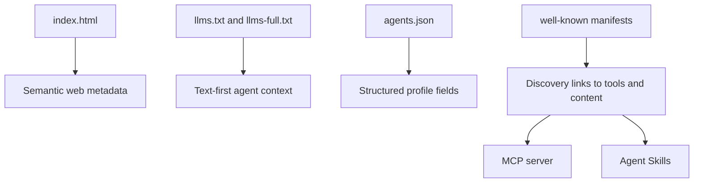

Machine-readable endpoints are the public contract that lets agents discover, summarize, and act on the site without scraping visual HTML. In this repository they are not generated automatically. They are authored files that sit beside the main site and intentionally mirror the same identity in different formats.

## What This Concept Is

The core endpoint set is:

- [`llms.txt`](/workspace/home/personal-site/llms.txt)
- [`llms-full.txt`](/workspace/home/personal-site/llms-full.txt)
- [`agents.json`](/workspace/home/personal-site/agents.json)
- [`.well-known/ai-plugin.json`](/workspace/home/personal-site/.well-known/ai-plugin.json)
- [`.well-known/agent-card.json`](/workspace/home/personal-site/.well-known/agent-card.json)
- [`.well-known/api-catalog`](/workspace/home/personal-site/.well-known/api-catalog)
- [`vercel.json`](/workspace/home/personal-site/vercel.json)

Together they solve a basic problem: a normal landing page is optimized for people, but agents need a cleaner and more explicit interface. [`index.html`](/workspace/home/personal-site/index.html) includes semantic markup and JSON-LD, but the repository still publishes alternate representations because structured access should not depend on DOM parsing.

## How It Relates to Other Concepts

These endpoints are the discovery layer for the rest of the system. They point agents toward profile information, structured metadata, and the MCP tool surface. The Agent Skills registry is richer content, and the MCP server is active behavior, but both depend on the site already being discoverable.



## How It Works Internally

There is no content compiler stitching these files together. The duplication is manual, which is visible in the source:

- [`index.html`](/workspace/home/personal-site/index.html) includes `<link rel="alternate">` tags for `/llms.txt`, `/agents.json`, and `/.well-known/ai-plugin.json`.
- [`vercel.json`](/workspace/home/personal-site/vercel.json) attaches an HTTP `Link` header advertising `llms.txt`, `agents.json`, and the AI plugin manifest.
- [`agents.json`](/workspace/home/personal-site/agents.json) provides the most structured identity surface, including `interfaces`, `expertise`, `contact`, and `projects`.
- [`llms-full.txt`](/workspace/home/personal-site/llms-full.txt) goes further than the shorter profile by documenting the notebook, MCP server, and site architecture in prose.

This is a deliberate authoring model. Instead of generating summaries from the homepage, the repo maintains channel-specific versions tuned for how each consumer reads:

- Browser: full visual page
- LLM context: concise plain text
- Structured integration: JSON object graph
- Discovery: `.well-known` manifests and link relations

### Basic usage

Fetch the concise profile:

```bash
curl https://katrinalaszlo.com/llms.txt
```

Fetch the structured version:

```bash
curl https://katrinalaszlo.com/agents.json
```

### Advanced usage

If you are building an agent crawler, use the discovery chain instead of hardcoding paths:

```bash
curl -I https://katrinalaszlo.com/
curl https://katrinalaszlo.com/.well-known/api-catalog
curl https://katrinalaszlo.com/.well-known/mcp/server-card.json
```

That pattern matches how the site is wired: `vercel.json` advertises discovery links at the HTTP layer, `.well-known/api-catalog` points to structured and textual descriptions, and the MCP server card tells a client where interactive capabilities live.

<Callout type="warn">Keep `index.html`, `llms.txt`, and `agents.json` synchronized manually. There is no generator enforcing consistency, so profile changes can drift across formats if you only update one file.</Callout>

<Accordions>
<Accordion title="Why duplicate the same profile in HTML, text, JSON, and well-known manifests?">
The duplication looks inefficient, but it removes ambiguity for every downstream consumer. A browser can render the homepage, a coding agent can ingest `llms.txt` directly, and a stricter integration can depend on `agents.json` without scraping prose. The alternative is to derive every format from one canonical file, which sounds cleaner but introduces a build pipeline and a transformation step that this repository explicitly avoids. In a static site that changes infrequently, repeated authored files are a reasonable trade-off because they keep the output obvious and inspectable.
</Accordion>
<Accordion title="What do you lose by keeping discovery metadata as static files instead of generating it?">
You lose guaranteed consistency and schema validation at authoring time. For example, if you add a new project to `agents.json` but forget to mention it in `llms.txt`, the site still deploys cleanly even though the public story diverges. You also need to manually maintain cross-links such as the `Link` header in `vercel.json` and the resources listed in `.well-known/agent-card.json`. The gain is operational simplicity: any hosting stack that can serve files and one serverless function can publish the full surface.
</Accordion>
</Accordions>

## Source Highlights

Short snippets from the repository show the pattern clearly:

```html
<link rel="alternate" type="text/plain" href="/llms.txt" title="LLM-optimized content">
<link rel="alternate" type="application/json" href="/agents.json" title="Agent capabilities manifest">
```

Those lines come from [`index.html`](/workspace/home/personal-site/index.html) and make the alternate surfaces discoverable even before an agent looks under `.well-known/`.

```json
{
  "interfaces": {
    "human": "/",
    "llm": "/llms.txt",
    "structured": "/agents.json"
  }
}
```

That object comes from [`agents.json`](/workspace/home/personal-site/agents.json) and formalizes the multi-interface design directly.

## Practical Pattern

When you add new subject matter to the site, update the endpoint layer in the same commit:

1. Human-facing page or note.
2. Plain-text summary in `llms.txt` or `llms-full.txt`.
3. Structured update in `agents.json` if the change affects projects, expertise, or contact.
4. Discovery files only if you added a new capability class, such as a new MCP resource or manifest.

The companion guide for this workflow is [Update Profile Endpoints](/docs/guides/update-profile-endpoints).
