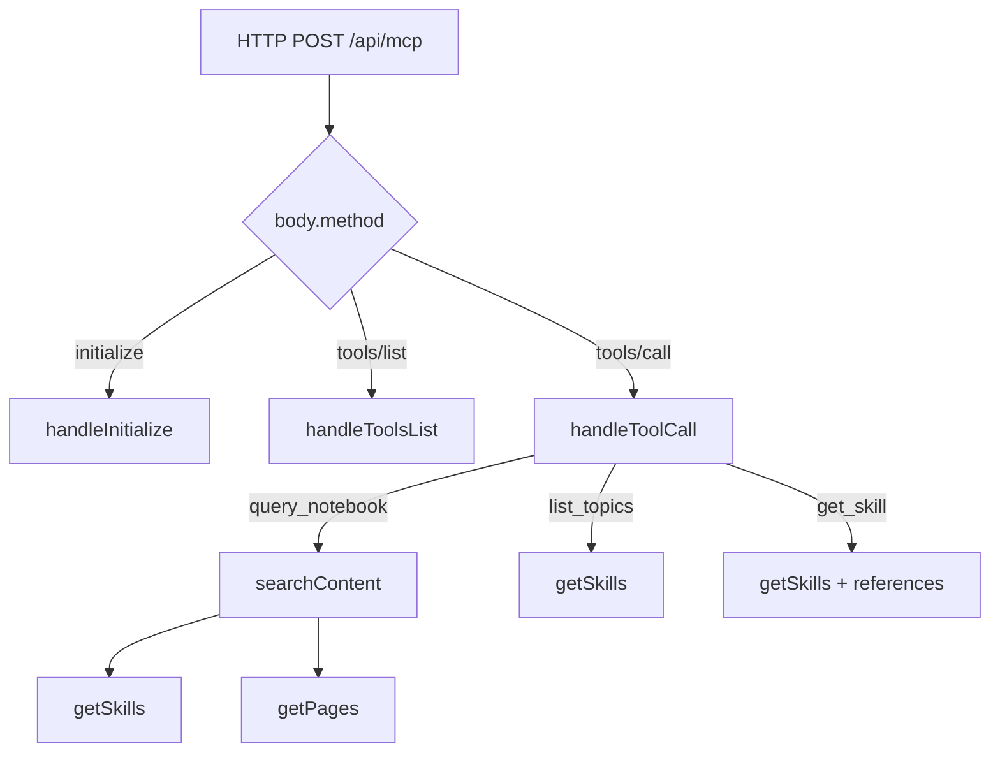

The MCP server is the repository’s runtime layer. Everything else is static content or metadata; [`api/mcp.js`](/workspace/home/personal-site/api/mcp.js) turns that content into a JSON-RPC interface that agents can query.

## What This Concept Is

The exported module in [`api/mcp.js`](/workspace/home/personal-site/api/mcp.js) is a Vercel-compatible handler:

```ts
type Handler = (req: VercelRequest, res: VercelResponse) => Promise<void>;
```

Its job is narrow:

- accept HTTP `POST` requests
- speak JSON-RPC
- support MCP initialization
- list available tools
- dispatch tool calls
- read notebook pages and skills from disk

That design solves a specific problem: expose rich local content to agents without introducing a separate search service or API backend.

## How It Relates to Other Concepts

The server sits on top of the machine-readable files and the skill registry. Discovery manifests tell clients the endpoint exists, while the skills and notebook HTML provide the searchable corpus. Without the underlying static files, the handler has nothing to return.



## How It Works Internally

There are four important internal stages.

### 1. Content loading

At the top of the file, the handler derives:

```js
const SKILLS_DIR = path.join(process.cwd(), ".well-known", "agent-skills");
const NOTEBOOK_DIR = path.join(process.cwd(), "notebook");
```

Those paths make the deployment assumption explicit: the function expects to run from the repository root. `loadSkills()` reads the indexed skills, and `loadNotebookPages()` reads every notebook HTML file except `index.html`.

### 2. Content normalization

Notebook pages are not searched as raw HTML. `stripHtml()` removes scripts, styles, navigation, headers, footers, tags, and entity markers, then normalizes whitespace. That makes search results cleaner for agents and prevents navigation chrome from dominating the index.

### 3. Caching

`skillsCache` and `pagesCache` are module-level variables. `getSkills()` and `getPages()` lazily populate them. In a warm serverless instance, repeated calls avoid disk reads. In a cold start, the first call rebuilds both caches.

### 4. Request dispatch

The exported handler:

1. sets permissive CORS headers
2. handles `OPTIONS`
3. rejects non-`POST` methods with `405`
4. validates that `req.body.method` exists
5. switches on `initialize`, `tools/list`, `tools/call`, and `notifications/initialized`

`query_notebook` uses `searchContent()`, which lowercases the query, splits it into whitespace-delimited terms, and scores each skill, reference, and notebook page by counting matching terms. Results are sorted descending by score and truncated to five items.

### Basic usage

Initialize a client:

```bash
curl -X POST https://katrinalaszlo.com/api/mcp \
  -H 'Content-Type: application/json' \
  -d '{
    "jsonrpc": "2.0",
    "id": 1,
    "method": "initialize"
  }'
```

Search without a topic filter:

```bash
curl -X POST https://katrinalaszlo.com/api/mcp \
  -H 'Content-Type: application/json' \
  -d '{
    "jsonrpc": "2.0",
    "id": 2,
    "method": "tools/call",
    "params": {
      "name": "query_notebook",
      "arguments": {
        "query": "how to make a site agent-readable"
      }
    }
  }'
```

### Advanced usage

Constrain search to one skill topic:

```bash
curl -X POST https://katrinalaszlo.com/api/mcp \
  -H 'Content-Type: application/json' \
  -d '{
    "jsonrpc": "2.0",
    "id": 3,
    "method": "tools/call",
    "params": {
      "name": "query_notebook",
      "arguments": {
        "query": "four AX pillars",
        "topic": "agent-experience-design"
      }
    }
  }'
```

This works because `searchContent()` switches from the full skills object to `{ [topic]: skills[topic] }` when a topic is provided, which narrows the skill search space before scoring.

<Callout type="warn">The in-memory caches are convenient, but they also mean a warm serverless instance can serve stale content after a deploy until the instance is recycled. If you ever need strong freshness guarantees, the current cache strategy is the first place to change.</Callout>

<Accordions>
<Accordion title="Why use simple term matching instead of embeddings or full-text search?">
The repository optimizes for low operational overhead. Simple term counting is easy to understand, easy to debug, and requires nothing beyond the local filesystem. For the current corpus size, that is often enough because the content is tightly scoped and the queries are topic-rich. The trade-off is weaker ranking on paraphrases and synonym-heavy queries, but the implementation remains completely legible.
</Accordion>
<Accordion title="Why keep the MCP server in the same repository as the site content?">
Co-locating the handler with the content avoids synchronization failures between a content repo and a separate API repo. A deploy updates the visible site, the machine-readable files, the skills, and the MCP behavior together. The downside is that runtime logic now depends on local file layout such as `process.cwd()` and fixed directory names. That is acceptable here because the project values directness over reuse as a generic package.
</Accordion>
</Accordions>

## Public Surface

The public protocol surface is intentionally small:

- `initialize`
- `tools/list`
- `tools/call`
- `notifications/initialized`

Inside `tools/call`, only three tool names are supported:

- `query_notebook`
- `list_topics`
- `get_skill`

Everything else returns JSON-RPC `-32601` with `"Unknown tool: ..."`.

For the exact request and response contracts, continue to [MCP Endpoint](/docs/api-reference/mcp-endpoint) and [Tool Contracts](/docs/api-reference/tool-contracts).
